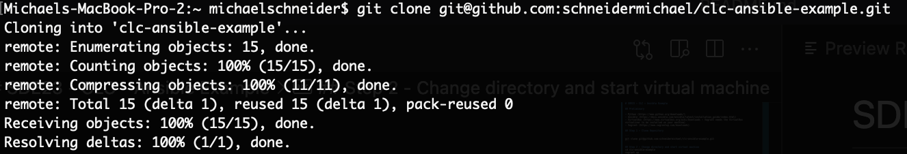
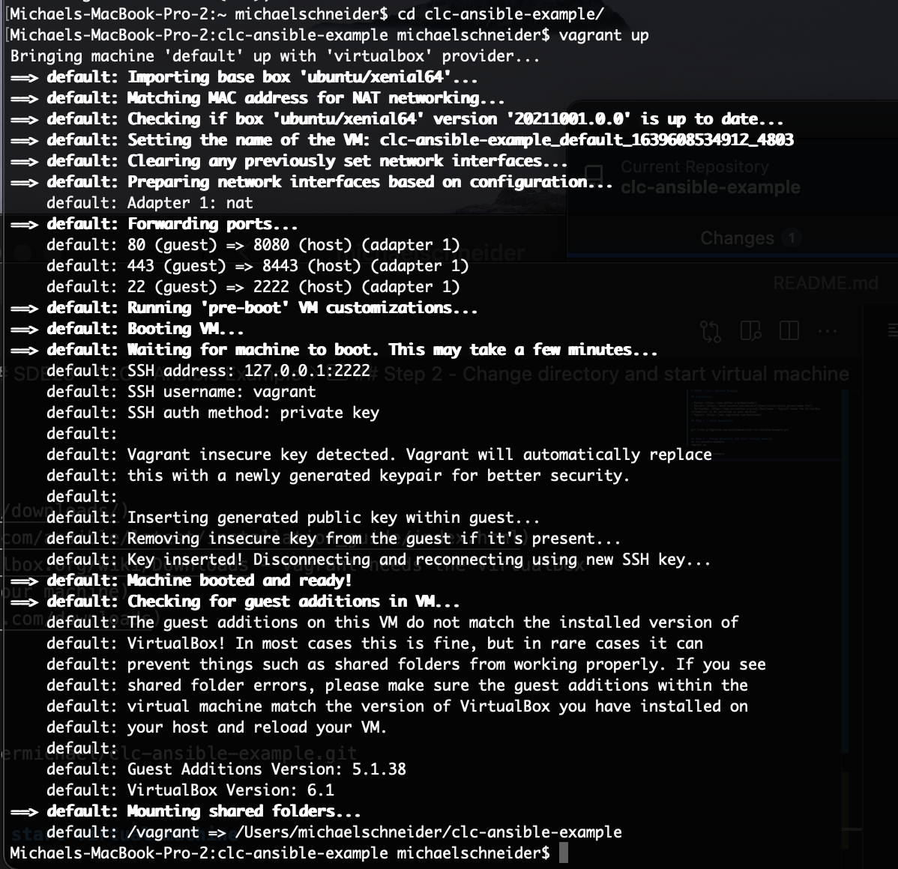
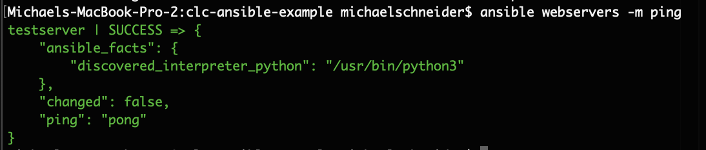
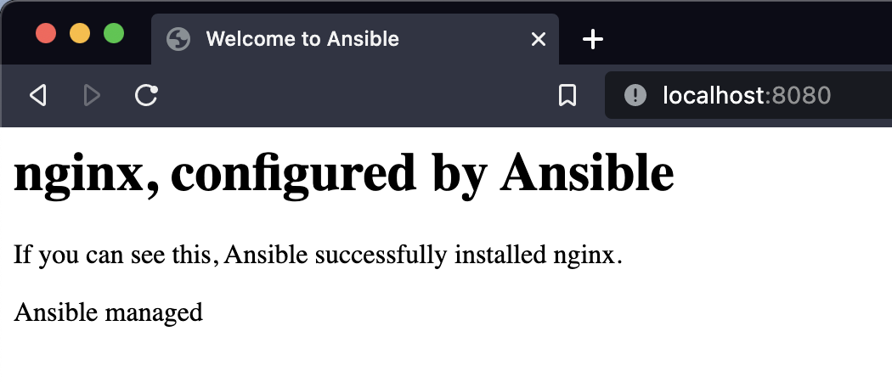

# SDE23 - CLC - Ansible Example

## Preliminary

- Python (https://www.python.org/downloads/)
- Ansible (https://docs.ansible.com/ansible/latest/installation_guide/index.html)
- VirtualBox (https://www.virtualbox.org/wiki/Downloads - Vagrant needs the VirtualBox virtualizer to be installed on your machine)
- Vagrant (https://www.vagrantup.com/downloads)

## Assignement

Installing the Nginx web server on an virtual machine

## Step 1 - Clone Repository

```
git clone git@github.com:schneidermichael/clc-ansible-example.git
```


## Step 2 - Change directory and start virtual machine

```
cd clc-ansible-example
vagrant up
```



## Step 3 - Ping server

```
ansible webservers -m ping
```



## Step 4 - Running the playbook

```
ansible-playbook web-notls.yml
```


## Step 5 - Go to http://localhost:8080

